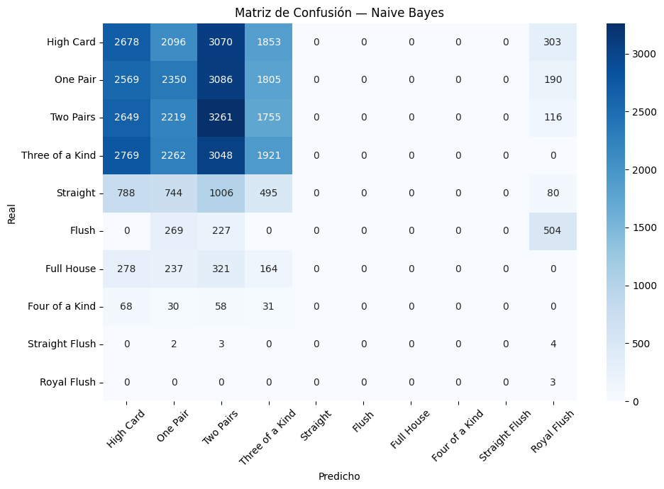
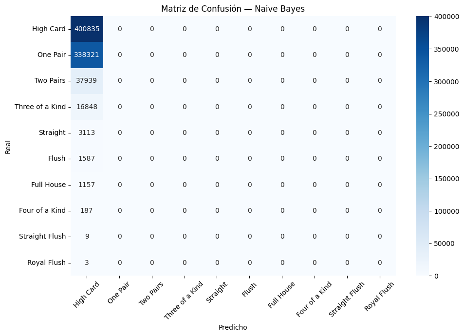
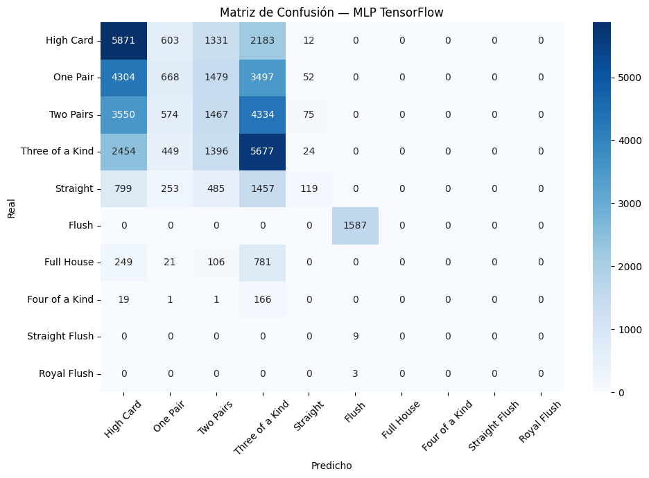
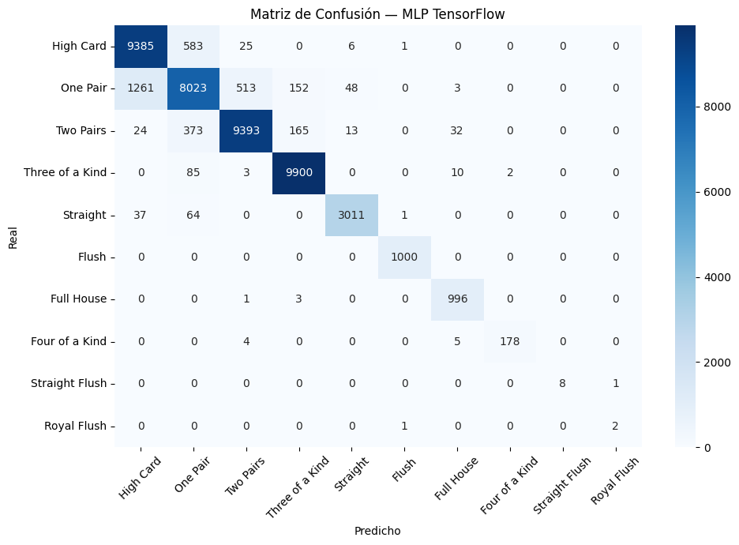

# 🃏 Detection of Poker Hands

Esta es mi entrega individual del proyecto de Inteligencia Artificial para el profesor **Benjamin Valdés Aguirre**.

**Poker Hand Classification**  
https://www.kaggle.com/datasets/dysphorfia/poker-hand-classification

El proyecto está organizado de la siguiente manera:

---

## 📁 Estructura del proyecto

### 🔹 dataset

Contiene los datos originales sin preprocesar:

* **test/**

  * `test.data` → Dataset de prueba sin preprocesar
* `train.data` → Dataset de entrenamiento sin preprocesar
* `validation.data` → Dataset de validación sin preprocesar

---

### 🔹 preprocesamiento

Carpeta donde se realiza todo el procesamiento de los datos:

* `construirValidation.py` → Código para generar el split de validación (el dataset original no lo incluye)
* `normalizacionDelDataset.py` → Normalización del dataset mediante:
  * Undersampling
  * Oversampling
  * One-Hot Encoding
  * Min-Max Scaler
* `preprocesamiento.py` → Script principal para generar los datasets preprocesados
* `preprocesamiento_test.data` → Dataset de prueba preprocesado
* `preprocesamiento_training.data` → Dataset de entrenamiento preprocesado
* `preprocesamiento_validation.data` → Dataset de validación preprocesado
* `preprocesamiento.md` → Documentación del proceso de preprocesamiento [Preprocesamiento](preprocesamiento/preprocesamiento.md)
* 

---

### 🔹 modelo

#### 📌 baseline

Definición de una línea base utilizando el algoritmo de clasificación **Naive Bayes**:

* `baselineNaiveBayes.ipynb` → Código para calcular la línea base
* `image.png` → Imagen de la matriz de confusión
* `Baseline.md` → Documentación del baseline [Baseline](modelo/baseline/Baseline.md)

---

#### 📌 mlp_raw

Modelo de red neuronal (MLP) entrenado con los datos originales (sin preprocesamiento):

* `MLP_raw.ipynb` → Entrenamiento y exportación del modelo
* `modelo_poker_raw.keras` → Modelo entrenado exportado
* `pruebaDelMlp_raw.ipynb` → Pruebas y consultas al modelo
* `encoder.pkl` → Codificador One-Hot para procesar inputs
* `scaler.pkl` → Escalador Min-Max para normalización
* `image.png` → Matriz de confusión
* `MLP_raw.md` → Documentación del modelo raw[modelo_raw](modelo/mlp_raw/MLP_raw.md)

---

#### 📌 mlp_curado
Modelo de red neuronal (MLP) entrenado con los preprocesados:
* `MLP_curado.ipynb` → Entrenamiento y exportación del modelo
* `modelo_poker_curado.keras` → Modelo entrenado exportado
* `pruebaDeMLP_curado.ipynb` → Pruebas y consultas al modelo
* `encoder.pkl` → Codificador One-Hot para procesar inputs
* `scaler.pkl` → Escalador Min-Max para normalización

Este modelo no requiere de documentacion pues es una copia del modelo_raw, unicamente cambiando el dataset que utilizamos anteriormente por el dataset preprocesado
---

#### 📌 mlp_optimizado
Modelo de red neuronal (MLP) entrenado con los preprocesados y hiperparametros ajustados de acuerdos al paper:
https://walintonc.github.io/papers/ml_pokerhand.pdf
* `MLP_optimizado.ipynb` → Entrenamiento y exportación del modelo
* `modelo_poker_optimizado.keras` → Modelo entrenado exportado
* `pruebaDeMlp_optimizado.ipynb` → Pruebas y consultas al modelo
* `test.ipynb` → Utilizo el modelo entrenado para evaluarlo con test y ver que tal se comporta con datos que el modelo nunca ha visto
* `encoder.pkl` → Codificador One-Hot para procesar inputs
* `scaler.pkl` → Escalador Min-Max para normalización
* modelo_poker_optimizado.keras
  #### chckpnt
  * `image.png` → Curva de aprendizaje (trainning accuracy vs validation accuracy)
  * `finalModel.keras` → Modelo entrenado con los hiperparametros del paper, con el objetivo de utilizarlo en las queries que el profesor quiera probar en el la evaluacion del modelo
  * `modelo_optimizado.md` → Documentación del modelo optimizado[modelo_raw](modelo/mlp_optimizado/modelo_optimizado.md)

---

## Resultados
Los resultados los mediremos utilizando las medidas de:
* Accuracy: Mide la proporción de predicciones correctas respecto al total de predicciones realizadas.
* Recall: Mide la capacidad del modelo para identificar correctamente todos los casos positivos de una clase.
* F1: Mide el balance entre precisión y cobertura
---

### Que significan estos resultados?
Evaluemoslos: 

#### Baseline:
Métricas del modelo Naive Bayes:
* Accuracy : 0.2254
* Recall   : 0.2021
* F1       : 0.0967

#### Modelo Raw:
* Accuracy : 0.6511
* Recall   : 0.1606
* F1       : 0.1692

#### Modelo Curado:
* Accuracy : 0.3341
* Recall   : 0.2407
* F1       : 0.2188

* Accuracy (val): 0.3444
* Recall   (val): 0.2680
* F1       (val): 0.2102

#### Modelo Optimizado:

* Accuracy : 0.9246
* Recall   : 0.9141
* F1       : 0.9189

* Accuracy (val): 0.8713
* Recall   (val): 0.9506
* F1       (val): 0.8756

Para empezar podemos ver la clara mejora en la matriz de confusion, la cual nos explica el como el modelo se va volviendo mas preciso tras el refinamiento de este. 

En el modelo raw obtuvimos un gran accuracy a comparaciopn de las otras metricas por el desbalance del modelo, puesto a que detecta normalmente el High Card o One Pair "memorizando" esos resultados pues acierta la mayor cantidad de veces al elegirlos

En el Curado, reducimos las clases de mayor volumen con el objetivo de que el modelo se concentre tambien en las de menor tamaño, pero este mismo esta aprendiendo demasiado lento, causando underfitting

Por ultiimo en el Optimizado, utilizando los hiperparametros conseguimos refinar el modelo para que aprenda a un mejor paso y se comporte mejor ante datos que no haya visto todavia

### Conclusion
En

### Mejoras a Futuro

## 📍 Ethan Luna

Entrega individual — Proyecto de Inteligencia Artificial
