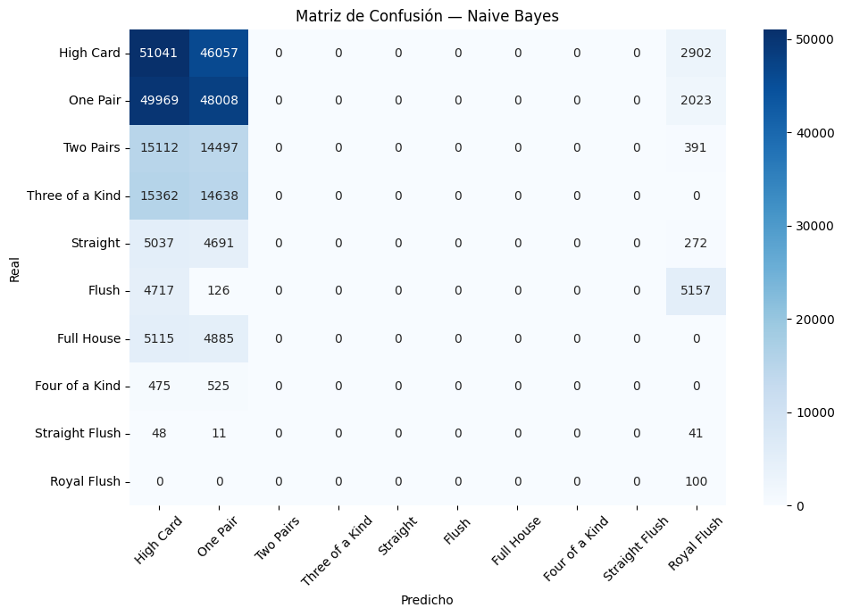

Este script entrena y evalúa un modelo de clasificación Naive Bayes Gaussiano sobre un conjunto de datos de manos de póker. A continuación se describe cada sección:

Se lee un archivo CSV preprocesado (preprocessed_trainning.data) que no tiene
encabezado. Las columnas se dividen en:
  - x: todas las columnas menos la última (características/features).
  - y: la última columna (etiqueta de clase).

Las clases son 10 tipos de manos de póker numeradas del 0 al 9:
  0: High Card        5: Flush
  1: One Pair         6: Full House
  2: Two Pairs        7: Four of a Kind
  3: Three of a Kind  8: Straight Flush
  4: Straight         9: Royal Flush

```python
df = pd.read_csv('../preprocesamiento/preprocessed_trainning.data', header=None)
x = df.iloc[:, :-1]
y = df.iloc[:, -1]
```

Se instancia un clasificador GaussianNB (Naive Bayes con distribución gaussiana) y se entrena directamente sobre los datos de entrenamiento usando modelo_nb.fit(x, y). Después se generan predicciones sobre el mismo conjunto de entrenamiento con modelo_nb.predict(x).
```python
modelo_nb = GaussianNB()
modelo_nb.fit(x, y)
y_pred = modelo_nb.predict(x)
```
Se imprimen tres métricas de desempeño sobre las predicciones:
  - Accuracy : proporción de predicciones correctas sobre el total.
  - Recall   : utilizado para evitar falsos negativas.
  - F1 Score : promedio macro del F1, balance entre precisión y recall.

También se imprime el número total de instancias procesadas.
```python
print("Métricas del modelo Naive Bayes:")
print(f"Accuracy : {accuracy_score(y, y_pred):.4f}")
print(f"Recall   : {recall_score(y, y_pred, average='macro', zero_division=0):.4f}")
print(f"F1       : {f1_score(y, y_pred, average='macro', zero_division=0):.4f}")
print("Instancias procesadas:", len(y))

```
Se genera y visualiza una matriz de confusión con seaborn (heatmap en
escala azul). Los ejes muestran las 10 clases con sus nombres en texto.
  - Eje Y (Real):     la clase verdadera de cada instancia.
  - Eje X (Predicho): la clase que el modelo asignó.

Las celdas de la diagonal representan predicciones correctas; las fuera
de ella representan errores de clasificación. Las etiquetas del eje X
se muestran rotadas 45° para facilitar la lectura.

```python
cm_nb = confusion_matrix(y, y_pred)

plt.figure(figsize=(10, 7))
sns.heatmap(
    cm_nb, annot=True, fmt='d', cmap='Blues',
    xticklabels=nombres_ordenados,
    yticklabels=nombres_ordenados,
)
plt.title("Matriz de Confusión — Naive Bayes")
plt.xlabel("Predicho")
plt.ylabel("Real")
plt.tick_params(axis='x', rotation=45)
plt.tick_params(axis='y', rotation=0)
plt.tight_layout()
plt.show()
```

Los resultados de la baseline del algoritmo de clasificacion Naive-Bayes son los siguientes:

Métricas del modelo Naive Bayes:
* Accuracy : 0.3405
* Recall   : 0.1990
* F1       : 0.0843
* Instancias procesadas: 291200


Modelo NaiveBayes
https://scikit-learn.org/stable/modules/naive_bayes.html
