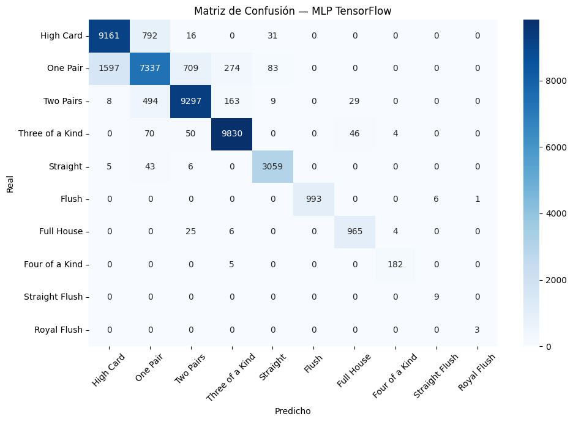
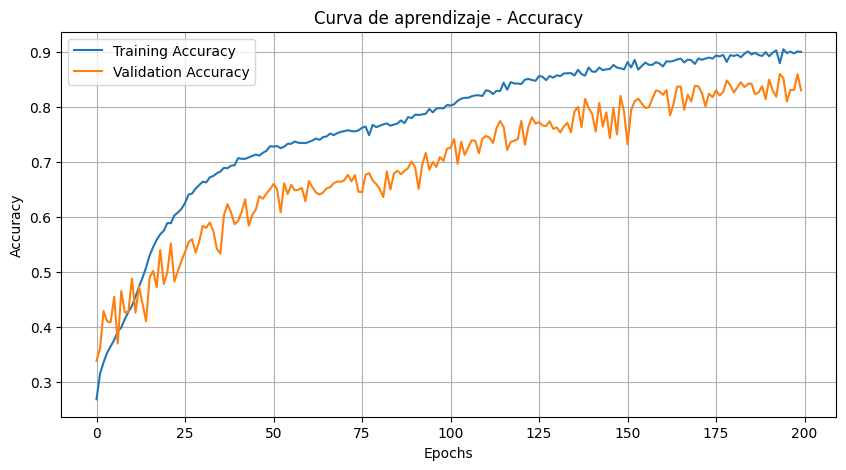

# Modelo Optimizado
Este modelo optimizado es igual al del mlp curado, lo unico que cambiamos son los hiperparametros 

### Metodo
Utilizamos lo recomendado en el paper, 1 capa de entrada, 3 capas densas con 100 neuronas cada una y un regularizador de  0.0001 para evitar el overfitting y una capa de salida utilizando softmax, pues los posibles resultados son mayores a 2
```python
modelo_tf = keras.Sequential([    
    # Capa de entrada: recibe vectores de tamaño n_features
    keras.layers.Input(shape=(n_features,)),
    # Primera capa oculta con 100 neuronas y activación ReLU
    keras.layers.Dense(100, activation='relu', kernel_regularizer=keras.regularizers.l2(0.0001)),
    # Segunda capa oculta con 10 neuronas y activación ReLU
    keras.layers.Dense(100, activation='relu', kernel_regularizer=keras.regularizers.l2(0.0001)),
    # Tercera capa oculta con 100 neuronas y activación ReLU
    keras.layers.Dense(100, activation='relu', kernel_regularizer=keras.regularizers.l2(0.0001)),
    # Capa de salida:
    # n_clases neuronas (una por clase)
    # softmax convierte las salidas en probabilidades
    keras.layers.Dense(n_clases, activation='softmax')
])
```

Compilador, cambiamos el Learning Rate a 0.01, para acelerar el aprendizaje del modelo igual utilizamos el optimizador adams 
```python
modelo_tf.compile(
    optimizer=adam(learning_rate=0.01), 
    loss='sparse_categorical_crossentropy',
    metrics=['accuracy']
)
```

Corremos el modelo durante 200 epocas, con batch size de 200, utilizando el validation data para evaluar la que no caigamos en over/under fitting
```python
history = modelo_tf.fit(
    x, y,
    epochs=200,
    batch_size=200,
    validation_data=(x_val, y_val), 
    verbose=1
)

```


# Resultados
Los resultados son los siguientes
Accuracy : 0.9246
Recall   : 0.9141
F1       : 0.9189

Accuracy (val): 0.8713
Recall   (val): 0.9506
F1       (val): 0.8756

# Matriz de confusion


# Curva de aprendizaje


Esto va de acuerdo a lo estipulado en el paper, el modelo termina con un accuracy de alrededor del 80%, aunque el modelo que estamos utilizando para las queries alcanzo una precision del casi 95% 

# Bibliografia
Utilizando los hiperparametros definidos en el siguiente paper:
[1]
W. Cambronero, “Poker Hand Dataset: A Machine Learning Analysis and a Practical Linear Transformation.” Accessed: Apr. 22, 2026. [Online]. Available: https://walintonc.github.io/papers/ml_pokerhand.pdf