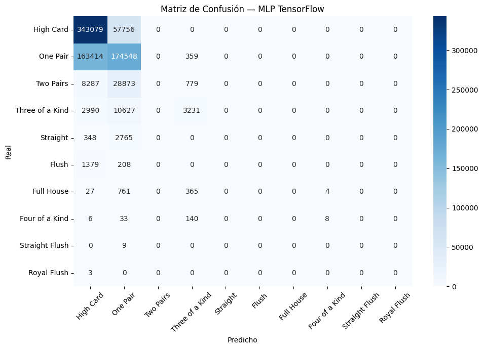

**Se utiliza un MLP para la prediccion de los datos** 

Este script entrena y evalúa una red neuronal multicapa (MLP) usando Keras sobre el mismo dataset de manos de póker. A continuación se describe cada sección:

Se lee el archivo CSV preprocesado (preprocesamiento_trainning.data) sin encabezado. Las columnas se dividen en:
  - x: todas las columnas menos la última 
  - y: la última columna 

Las clases son 10 tipos de manos de póker numeradas del 0 al 9:
  0: High Card        5: Flush
  1: One Pair         6: Full House
  2: Two Pairs        7: Four of a Kind
  3: Three of a Kind  8: Straight Flush
  4: Straight         9: Royal Flush

También se calcula:
  - n_clases  : número de clases únicas en y (10).
  - n_features: número de columnas de entrada en x.


```python
# Se lee el dataset preprocesado
df = pd.read_csv('../preprocesamiento/preprocesamiento_trainning.data', header=None)
x = df.iloc[:, :-1]
y = df.iloc[:, -1]
clases = sorted(y.unique().astype(int).tolist())
clase_nombres = {
    0: "High Card", 1: "One Pair", 2: "Two Pairs", 3: "Three of a Kind",
    4: "Straight",  5: "Flush",   6: "Full House", 7: "Four of a Kind",
    8: "Straight Flush", 9: "Royal Flush"
}
nombres_ordenados = [clase_nombres[c] for c in clases]


x = df.iloc[:, :-1].values
y = df.iloc[:, -1].values

# Número de clases distintas
# Número de características (features) por muestra
n_clases = len(np.unique(y))
n_features = x.shape[1]

```

Se construye una red neuronal secuencial con las siguientes capas:

  [Entrada]  → vector de tamaño n_features
      ↓
  [Dense 64, ReLU]  → primera capa oculta, 64 neuronas
      ↓
  [Dense 32, ReLU]  → segunda capa oculta, 32 neuronas
      ↓
  [Dense n_clases, Softmax] → capa de salida, una neurona por clase

  - ReLU (Rectified Linear Unit): activa la neurona solo si el valor es
    positivo; introduce no-linealidad sin saturar el gradiente.
  - Softmax: convierte los valores de salida en probabilidades que suman 1,
    una por cada clase.

modelo_tf.summary() imprime un resumen con el número de parámetros
entrenables por capa.

El modelo se compila con:
  - optimizer='adam'   : algoritmo de optimización adaptativo, ajusta la
                         tasa de aprendizaje automáticamente durante el
                         entrenamiento.
  - loss='sparse_categorical_crossentropy': función de pérdida para
                         clasificación multiclase cuando las etiquetas son
                         enteros (no one-hot encoded).
  - metrics=['accuracy']: métrica monitoreada durante el entrenamiento.

```python
  modelo_tf = keras.Sequential([    
      # Capa de entrada: recibe vectores de tamaño n_features
      keras.layers.Input(shape=(n_features,)),
      # Primera capa oculta con 64 neuronas y activación ReLU
      keras.layers.Dense(64, activation='relu'),
      # Segunda capa oculta con 32 neuronas y activación ReLU
      keras.layers.Dense(32, activation='relu'),
      # Capa de salida:
      # n_clases neuronas (una por clase)
      # softmax convierte las salidas en probabilidades
      keras.layers.Dense(n_clases, activation='softmax')
  ])

  # Compilación del modelo:
  modelo_tf.compile(
      optimizer='adam',  # algoritmo de optimización
      loss='sparse_categorical_crossentropy',  
      metrics=['accuracy']  # métrica de evaluación
  )

  # Muestra un resumen del modelo (capas, parámetros, etc.)
  modelo_tf.summary()

```

El modelo se entrena con modelo_tf.fit() usando los siguientes parámetros:
  - epochs=50         : el dataset completo se recorre 50 veces.
  - batch_size=32     : los pesos se actualizan cada 32 muestras.
  - validation_split=0.2 : el 20% de los datos se separa automáticamente
                         para validar el modelo en cada época, sin usarse
                         en el entrenamiento.
  - verbose=1         : muestra el progreso (loss y accuracy) por época.

```python

history = modelo_tf.fit(
    x, y,
    epochs=50,          # número de iteraciones completas sobre el dataset
    batch_size=32,      # tamaño de lote
    verbose=1           # muestra progreso en consola
)
```

modelo_tf.predict(x) devuelve una matriz de probabilidades (una fila por
muestra, una columna por clase). np.argmax(..., axis=1) selecciona el índice
de la clase con mayor probabilidad, convirtiéndolo en la etiqueta predicha.

Se imprimen tres métricas sobre el conjunto de entrenamiento completo:
  - Accuracy : proporción de predicciones correctas sobre el total.
  - Recall   : promedio macro del recall por clase.
  - F1 Score : promedio macro del F1, balance entre precisión y recall.

```python
# Predicciones del modelo (probabilidades por clase)
y_pred_tf = np.argmax(modelo_tf.predict(x), axis=1)

# Se usa argmax para convertir probabilidades en la clase con mayor valor


# Accuracy: proporción de aciertos
print(f"Accuracy : {accuracy_score(y, y_pred_tf):.4f}")
# Recall macro: promedio del recall por clase (útil en datasets desbalanceados)
print(f"Recall   : {recall_score(y, y_pred_tf, average='macro', zero_division=0):.4f}")
# F1-score macro: balance entre precisión y recall por clase
print(f"F1       : {f1_score(y, y_pred_tf, average='macro', zero_division=0):.4f}")

```

Se calcula y visualiza la matriz de confusión con seaborn (heatmap azul).
  - Eje Y (Real):     clase verdadera de cada muestra.
  - Eje X (Predicho): clase asignada por el modelo.

Las celdas en la diagonal son aciertos; las fuera de ella son errores.
Las etiquetas del eje X se rotan 45° para facilitar la lectura.

```python
# Calcula la matriz de confusión
cm_tf = confusion_matrix(y, y_pred_tf)

# Se grafica con seaborn
plt.figure(figsize=(10, 7))
sns.heatmap(
    cm_tf, 
    annot=True,        # muestra números dentro de cada celda
    fmt='d',           # formato entero
    cmap='Blues',      # esquema de colores
    xticklabels=nombres_ordenados,
    yticklabels=nombres_ordenados,
)

# Etiquetas del gráfico
plt.title("Matriz de Confusión — MLP TensorFlow")
plt.xlabel("Predicho")
plt.ylabel("Real")

# Ajustes visuales
plt.tick_params(axis='x', rotation=45)
plt.tick_params(axis='y', rotation=0)
plt.tight_layout()

# Mostrar gráfico
plt.show()
```
Los resultados del proimer modelo de prediccion utilizando un MLP y tras 50 epocas son los siguientes:
* Accuracy : 0.6511
* Recall   : 0.1606
* F1       : 0.1692


Observacions:
  EStos resultados tan altos me preoucupan de overfitting usare validation para evaluarlo, el objetivo del siguiente entregable sera utilizar alguna arquitectura con la que se alcancen esos niveles de precision, recall y F1 sin la necesidad de 50 epocas de entrenamiento

MLP:
https://scikit--learn-org.translate.goog/stable/modules/neural_networks_supervised.html?_x_tr_sl=en&_x_tr_tl=es&_x_tr_hl=es&_x_tr_pto=tc